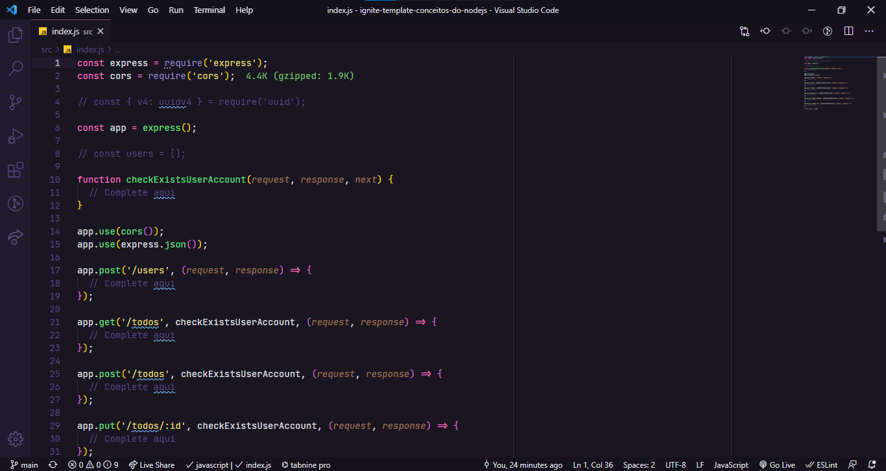

# Ignite NodeJs - Chapter 1 - Desafio 01 - Conceitos do NodeJS

<br/>
<div>
  
</div>


<br/>

# 🚀 Informações sobre o Desafio

Nesse desafio,tiver que criar uma aplicação para treinar o que aprendeu até agora no Node.js!

Essa será uma aplicação para gerenciar tarefas (em inglês *todos*). 
<br/>
Será permitida a criação de um usuário com `name` e `username`, bem como fazer o CRUD de *todos*:

- Criar um novo *todo*;
- Listar todos os *todos*;
- Alterar o `title` e `deadline` de um *todo* existente;
- Marcar um *todo* como feito;
- Excluir um *todo*;

Tudo isso para cada usuário em específico (o `username` será passado pelo header). A seguir veremos com mais detalhes o que e como precisa ser feito 🚀

## 💻 Documentação do desafio

- [Desafio 2 - Chapter 1 NodeJS](https://chip-dryosaurus-9ab.notion.site/Chapter-I-Desafio-01-Conceitos-do-Node-js-7644d955c1c04b938c004d743edfefd1)

<br/>

## 🖼️ Template do projeto

- [Template do projeto original para clone](https://github.com/rocketseat-education/ignite-template-conceitos-do-nodejs)

<br/>

## 🛠️ Tecnologias/Ferramentas ultilizadas

- [NodeJs](https://nodejs.org/en/docs/)
- [Express](https://expressjs.com/pt-br/)
- [Uuid](https://www.npmjs.com/package/uuid)
- [Jest](https://testing-library.com/docs/)

## ⚙️ Instalação

```
# Abra um terminal e copie este repositório com o comando
$ git clone https://github.com/Hugovarellaa/ignite-template-conceitos-do-nodejs
```

```
# Acesse a pasta da aplicação
$ cd ignite-template-conceitos-do-nodejs

# Inicie a aplicação
$ yarn dev 
```

---

<p align="center">Feito com 💙 por Hugo Alves Varella</p>
